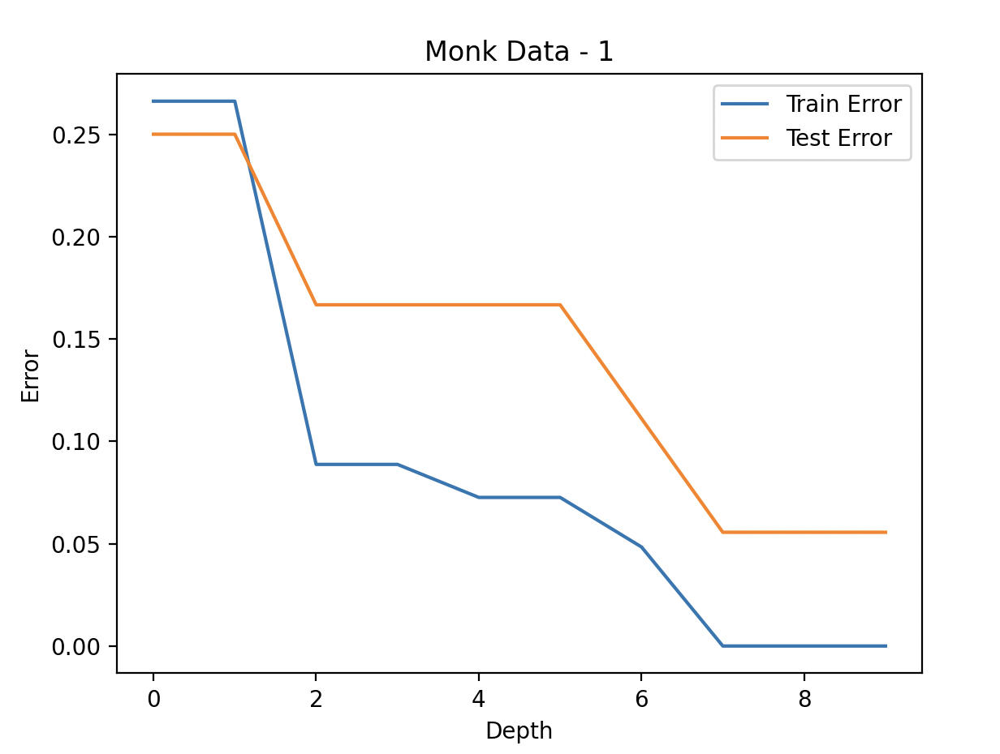
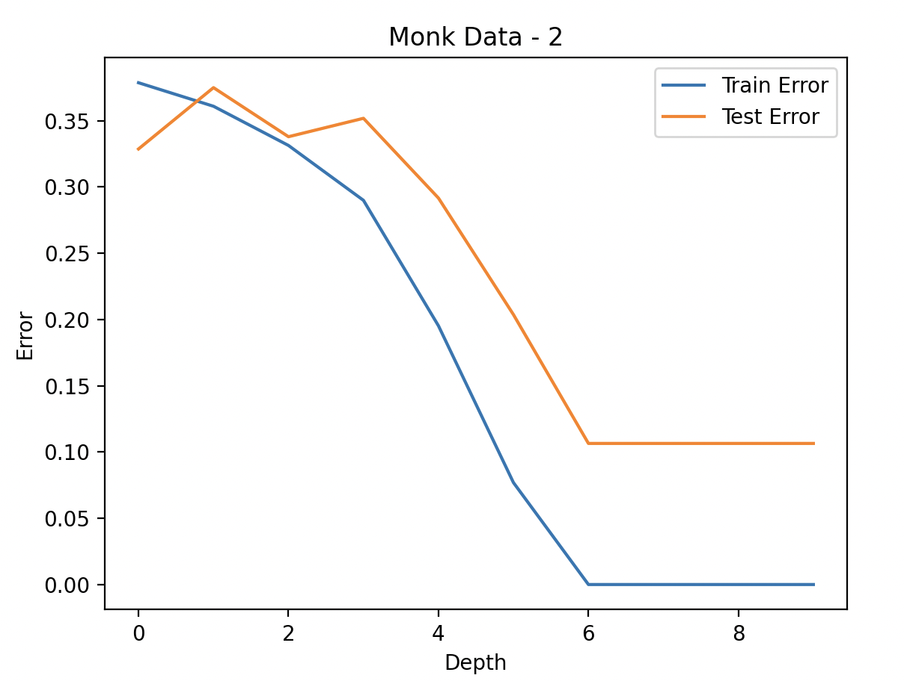
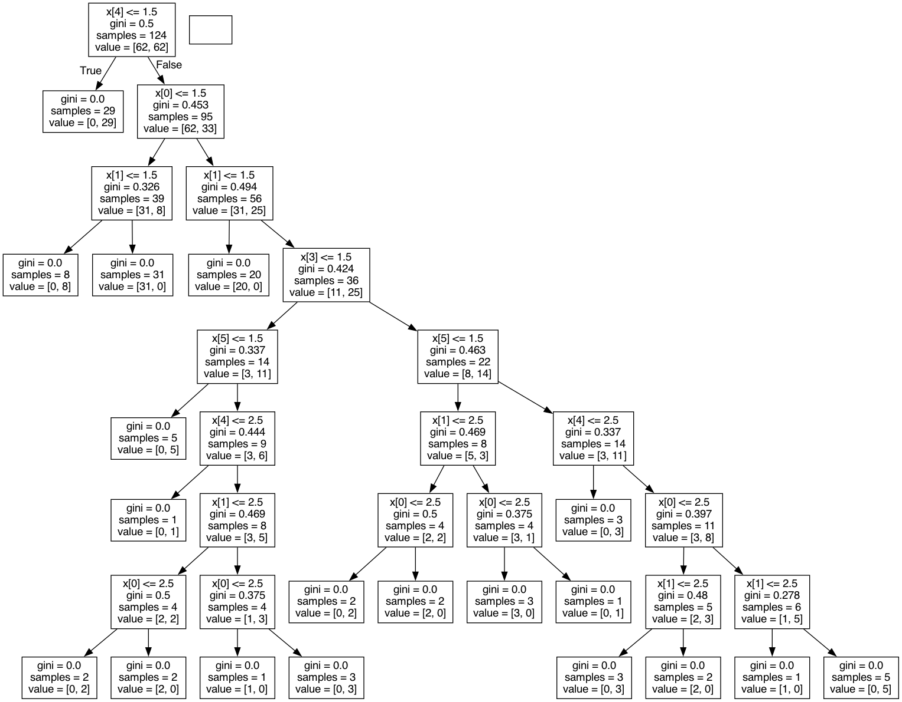
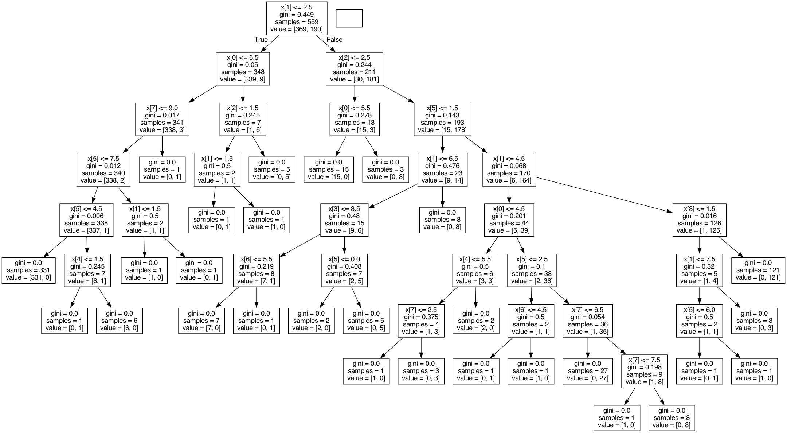

# DECISION TREE:


### What needs to be decided on while constructing a tree ? 
- Split feature
- Split point ( range, quantity)
- When to stop splitting

## STEPS : 

> TRAINING 
>- Givn the whole dataset
>1. Calculat the information gain with each possible split
>2. Divide set with that feature and value that gives the most IG
>3. Divide tree and do the same for all the created branches
>4. Until the stopping criteria is reached

> TESTING 
>1. Follow the tree until you reach a leaf node using the feature points
>2. Leaf node is either pure and not pure
>    - Leaf node is pure : Class of the leaf node.
>    - Leaf node is not pure : Majority / common class in leaf node


Information Gain:
```
E(parent) - [weighted_average]*E(children)
```
---

Entropy : Randomness of the datapoints
Values: 0 - 1 
    - 0 : when all the data belongs to one class (desired - split)
    - 1 : whem the data from + and - class is equal 
```
E = - SUM ( p(X) . log2(p(X) ) )
        # x
p(X) = -------
         n
```
---

> Stopping Criteria  
Based on the maximum depth, minimum number of samples, min impurity decrease     

---  

# Implementation

## From Scratch:
1. Data Set : Monks Dataset
2. Problem Statement:  
 For depth = 1, . . . , 10, learn decision trees and compute the average training and test errors on each of the three MONK’s problems.
3. Output of Average training and testing errors for Monks dataset for different depths




## Sklearn Implementation:
1. Data Set : Breast cancer dataset
2. Problem Statement: For depth = 1, . . . , 10, learn decision trees and compute the average training and test errors on breast cancer dataset

### Tree Visualization for Breast cancer and Monks-1 Dataset
1. Tree for Monks-1 Data set
  

2. Tree for Breast-cancer Dataset



### Confusion Matrix:
1. Confusion matrix for breast cancer wisconsin learned using sci-kit learn's DecisionTreeClassifier  
[48, 0]  
[3, 89]
2. Monks - 1 Dataset
- Depth 1:   
Confusion matrix:  
[108, 108]  
[0, 216]
- Depth 2:   
Confusion matrix:  
[108, 108]  
[0, 216] 
- Depth 10:   
Confusion matrix:  
[216, 0]  
[24, 192]  
- Confusion matrix for monks-1 learned using sci-kit learn's DecisionTreeClassifier  
[215, 1]  
[27, 189]   

## Conclusion : 
The Result obtained from decision tree implemented from scratch and sklearn model are similar
